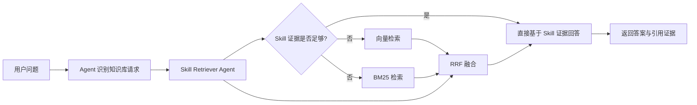

# Mini-OpenClaw

本项目是一个面向本地运行、文件优先、可审计的 Agent 工作台。

- 对话、工具调用、检索过程都会落到本地文件
- 长期记忆使用可直接编辑的 `Markdown`
- 技能不是黑盒函数，而是可读可改的 `SKILL.md`
- 前端可以直接看到流式回复、工具链路和检索证据

如果你想做一个“能解释自己为什么这样回答”的 Agent，这个仓库就是为这种方向准备的。

## 项目特点

- 本地优先：后端和前端都可以直接本地启动，不依赖 MySQL / Redis
- 文件即事实源：`memory/`、`workspace/` 和本地 `knowledge/` 都是可见、可改、可版本管理的文件
- Prompt 可解释：系统提示词由多个 Markdown 文件实时组装
- 技能可审计：每个技能都是 `skills/*/SKILL.md`
- 检索可观测：前端会展示知识检索步骤、证据来源和工具调用

## 当前能力

- FastAPI + SSE 流式聊天
- 会话持久化到 `backend/sessions/*.json`
- 长期记忆文件：`backend/memory/MEMORY.md`
- 可切换的记忆 RAG 模式
- 本地知识库检索
- 前端三栏工作台
- 在线编辑 Memory / Skills / Workspace 文件
- 检索证据、工具调用、Raw Messages 可视化

当前内置技能包括：

- `rag-skill`：本地知识库检索
- `web-search`：联网搜索
- `get_weather`：天气查询
- `retry-lesson-capture`：失败经验沉淀

## 知识库目录说明

仓库自带示例知识库，位于 `backend/knowledge/`。

其中包含：

- FAQ / Markdown / JSON 示例数据
- PDF / Excel 等异构知识文件
- 顶层和子目录的 `data_structure.md`

你可以直接使用仓库内已有知识文件做体验，也可以继续向该目录补充自己的资料。

## 知识库检索链路

当前仓库已经实现了一条“Skill 优先，混合检索兜底”的知识检索链路。

### 已实现流程



### 当前实现范围

- `skill` 检索始终优先执行
- 当 `skill` 结果为 `partial / not_found / uncertain` 时，才触发混合检索兜底
- 混合检索当前由：
  - 向量检索
  - BM25 检索
  - RRF 融合
  组成
- 当前知识索引主要覆盖 `knowledge/` 中的 `.md` 和 `.json`
- Excel / PDF 仍主要依赖 `rag-skill` 的专门处理流程

相关代码位置：

- 后端入口：[backend/app.py](backend/app.py)
- Agent 主入口：[backend/graph/agent.py](backend/graph/agent.py)
- 知识检索编排：[backend/knowledge_retrieval/orchestrator.py](backend/knowledge_retrieval/orchestrator.py)
- 向量 / BM25 索引：[backend/knowledge_retrieval/indexer.py](backend/knowledge_retrieval/indexer.py)
- 混合检索：[backend/knowledge_retrieval/hybrid_retriever.py](backend/knowledge_retrieval/hybrid_retriever.py)
- 技能检索代理：[backend/knowledge_retrieval/skill_retriever_agent.py](backend/knowledge_retrieval/skill_retriever_agent.py)

## 系统结构

```text
ragclaw/
├─ backend/
│  ├─ api/                    # Chat、session、file、token、knowledge index 接口
│  ├─ graph/                  # Agent、prompt、session、memory 相关逻辑
│  ├─ knowledge/              # 仓库内置示例知识库
│  ├─ knowledge_retrieval/    # Skill 优先 + hybrid fallback 检索链路
│  ├─ memory/                 # 长期记忆文件
│  ├─ scripts/                # 评测与辅助脚本
│  ├─ sessions/               # 会话历史
│  ├─ skills/                 # 技能目录，每个技能核心是 SKILL.md
│  ├─ storage/                # 索引、评测产物等缓存
│  ├─ tools/                  # terminal / read_file / python_repl / fetch_url
│  ├─ workspace/              # SOUL / USER / AGENTS 等系统上下文组件
│  └─ app.py                  # FastAPI 入口
├─ frontend/
│  ├─ src/app/                # 页面入口
│  ├─ src/components/         # 聊天面板、检索面板、编辑器等 UI
│  └─ src/lib/                # API 客户端与状态管理
└─ README.md
```

## 技术栈

### 后端

- Python 3.10+
- FastAPI
- Uvicorn
- LangChain 1.x
- LlamaIndex
- OpenAI-compatible model API
- Ragas（用于离线评估）

### 前端

- Next.js 14
- React 18
- TypeScript
- Tailwind CSS
- Monaco Editor

## 默认模型配置

代码层默认配置见 [backend/config.py](backend/config.py)：

- LLM Provider: `zhipu`
- LLM Model: `glm-5`
- Embedding Provider: `bailian`
- Embedding Model: `text-embedding-v4`

示例环境文件 [backend/.env.example](backend/.env.example) 默认使用：

- LLM Provider: `zhipu`
- Embedding Provider: `zhipu`

也支持：

- `zhipu`
- `bailian`
- `deepseek`
- `openai`

## 环境变量

示例文件见 [backend/.env.example](backend/.env.example)。

当前配置读取顺序：

1. 优先读取 `backend/.env`
2. 若未配置，再回退到系统环境变量

最少建议配置：

```env
LLM_PROVIDER=zhipu
LLM_MODEL=glm-5
ZHIPU_API_KEY=your_key

EMBEDDING_PROVIDER=zhipu
EMBEDDING_MODEL=embedding-3
EMBEDDING_API_KEY=your_key

TAVILY_API_KEY=your_key
```

## 快速开始

### 1. 启动后端

```powershell
cd backend
python -m venv .venv
.venv\Scripts\activate
pip install -r requirements.txt
copy .env.example .env
python -m uvicorn app:app --host 127.0.0.1 --port 8004 --reload
```

后端健康检查：

```text
http://127.0.0.1:8004/health
```

### 2. 启动前端

```powershell
cd frontend
npm install
npm run dev
```

前端默认地址：

```text
http://127.0.0.1:3000
```

前端默认请求后端：

```text
http://127.0.0.1:8004/api
```

如果后端端口不是 `8004`，可以设置：

```powershell
$env:NEXT_PUBLIC_API_BASE_URL="http://127.0.0.1:8010/api"
```

## 5 分钟体验路径

1. 启动前后端，发送一条普通聊天消息，确认流式输出正常
2. 打开右侧 Inspector，查看工具调用和 Raw Messages
3. 试着编辑 `backend/memory/MEMORY.md`
4. 提一个知识库问题，观察 Skill 检索和 fallback 检索是否出现
5. 查看 `backend/sessions/*.json`，确认消息、工具和检索记录已落盘

## 常用接口

- `GET /health`
- `POST /api/chat`
- `GET /api/sessions`
- `GET /api/files`
- `POST /api/files`
- `GET /api/config/rag-mode`
- `PUT /api/config/rag-mode`
- `GET /api/knowledge/index/status`
- `POST /api/knowledge/index/rebuild`

## 评测脚本

仓库内已经包含 FAQ 检索评测相关脚本，产物会写入：

- `backend/storage/eval_outputs/`

适合做：

- 路由命中率评测
- FAQ 检索准确率评测
- Ragas 指标评测

## 当前边界

- 更适合本地开发和研究，不是完整的生产 SaaS
- Excel / PDF 的高级处理仍主要依赖技能链路
- 混合检索当前主要覆盖 Markdown / JSON 类知识文件
- 技能和知识链路仍在快速迭代中

## 致谢

`skill` 设计思路参考了 [ConardLi/rag-skill](https://github.com/ConardLi/rag-skill)。
