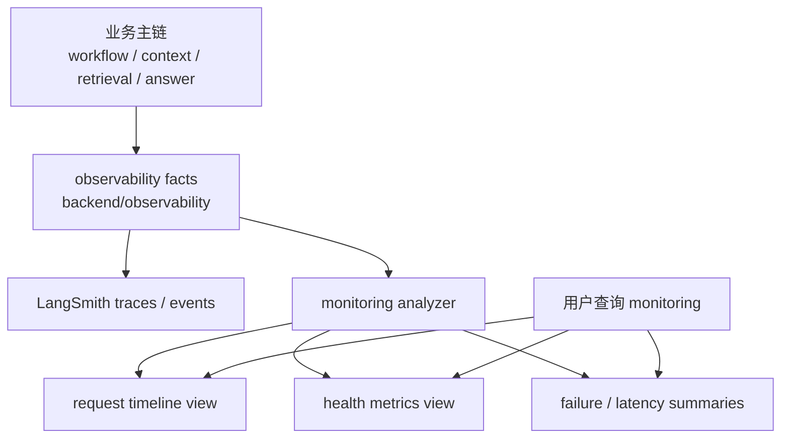

# Monitoring Phase 1 Plan

本文档用于把当前 `monitoring` handoff 收束成一版可执行的一期规划，覆盖：

- 需求清单
- 模块图
- 实施顺序
- 边界与非目标
- 第一批待确认问题

它的定位是：

- 第一次正式做 `monitoring` 时的启动文档
- 比 handoff 更可执行
- 但仍不是最终架构定稿

---

## 1. 一期目标

`monitoring` 一期的目标不是做完整监控平台，而是先把 `Workflow + 主回答链` 的最小运行态健康系统做起来。

第一阶段应完成：

1. 能按 `trace_id / session_id / query_id` 回看一次请求
2. 能串起 `request -> intent -> context -> workflow -> action -> answer` 最小事实链
3. 能看出关键步骤是否发生、是否成功、是否明显变慢
4. 能按 `route / action / status` 做最小聚合
5. LangSmith 未开启时不影响主业务

一句话定义：

> 一期要解决的不是“回答质量好不好”，而是“这条分层主链是否正常、稳定、可回看、可定位问题”。

---

## 2. 需求清单

### 2.1 分类一：链路可回看

目标：

- 给一次真实请求建立最小可追踪视图

一期必须支持：

- 根据 `trace_id` 找到同一条请求的相关运行事实
- 根据 `session_id` 查看同会话内相邻请求
- 根据 `query_id` 对齐单次问答上下文
- 看到这次请求经过了哪些阶段
- 看到每个阶段的状态、开始结束、关键摘要

最小验收标准：

- 能在一个统一视图中看到 `intent_classification_run`、`context_assembly_run`、`workflow_run`、`answer_model_run`
- retrieval 作为可选分支出现，不再假设每条链固定包含 `retrieval_run`
- 若触发了 compaction，也能看到 `compaction_run` 与 `pre_compaction_extraction_run`

### 2.2 分类二：主回答链健康观察

目标：

- 判断主回答链是否正常运转

一期必须支持：

- 统计请求总数
- 统计 route 分布
- 统计 action 分布
- 统计 answer 成功率
- 统计 answer latency
- 统计主回答 fallback 比例

建议最小健康问题集：

- 哪些 route 最近失败变多
- 哪些 action 响应明显变慢
- 哪些请求进入了 fallback
- `workflow` 成功但 `answer` 失败的比例是否异常

### 2.3 分类三：Retrieval / Context / Compaction 运行观察

目标：

- 判断 retrieval 与 context 组装链路是否稳定产出预期事实

一期必须支持：

- 统计 retrieval run rate
- 统计 retrieval 命中量分布
- 统计 `core` block 注入率
- 统计 `retrieved_memories` block 注入率
- 统计 compaction rate
- 统计 pre-compaction extraction success rate
- 统计 compaction skipped / failed rate

建议最小健康问题集：

- 最近是否出现 retrieval 明显没发生的请求增多
- memory hit 是否明显下降
- compaction 是否异常频繁
- pre-compaction extraction 是否出现失败堆积

### 2.4 分类四：异常定位辅助

目标：

- 当请求出问题时，能快速判断问题大概落在哪一层

一期必须支持：

- 区分 `workflow` 失败、`context` 失败、`retrieval` 失败、`answer` 失败
- 区分“未发生”和“发生但失败”
- 保留足够的摘要字段支持人工复盘

注意：

- 一期只做“辅助定位”
- 不做自动归因引擎

---

## 3. 一期模块图

### 模块拆分说明

#### 模块 A：事实来源层

职责：

- 复用现有 `backend/observability/`
- 不在一期重造新事实层

输入事件：

- `workflow_run`
- `answer_model_run`
- `retrieval_run`
- `context_assembly_run`
- `compaction_run`
- `pre_compaction_extraction_run`

原则：

- 只补必要字段
- 不反向重塑业务 contract

#### 模块 B：监测分析层

职责：

- 把原始事实整理成 monitoring 可消费的运行健康视图

一期建议承担：

- 事件归并
- request timeline 拼装
- route / action / status 聚合
- latency 聚合
- 关键失败分类

不建议一期承担：

- 告警编排
- 历史仓库化
- 自动异常根因推断

#### 模块 C：请求回看视图

职责：

- 面向单次请求复盘

一期建议输出：

- request 基本标识
- 主链阶段顺序
- 每阶段状态
- 每阶段耗时
- 是否触发 retrieval / compaction / extraction
- 关键摘要字段

#### 模块 D：最小聚合视图

职责：

- 面向一段时间内的健康观察

一期建议输出：

- 请求总量
- route 分布
- action 分布
- success / failure rate
- P50 / P95 latency
- retrieval rate
- compaction rate

---

## 4. 数据来源与字段建议

### 4.1 现阶段优先消费的代码入口

- 主回答入口：
  - `backend/graph/agent.py`
- Workflow 执行层：
  - `backend/workflow/orchestrated/execution_layer/engine/execution_layer.py`
- Context 组装层：
  - `backend/context/assembly/context_manager.py`

### 4.2 一期建议稳定使用的关联键

优先级建议：

1. `trace_id`
2. `session_id`
3. `query_id`
4. event 自身 `run_id`

原因：

- `trace_id` 最适合串整条主链
- `session_id` 适合看同会话连续异常
- `query_id` 适合贴近单次请求语义
- `run_id` 适合单事件精确定位

### 4.3 一期建议优先消费的字段类别

请求标识类：

- `trace_id`
- `session_id`
- `query_id`
- route / action

状态类：

- success / failure / skipped
- fallback 是否发生

耗时类：

- event latency
- 主回答总耗时

上下文类：

- retrieval 是否发生
- retrieval hits 摘要
- `core` block 是否存在
- `retrieved_memories` block 是否存在
- compaction / extraction 是否发生

注意：

- 一期先尽量基于摘要字段工作
- 不默认要求全量 prompt / transcript / 全量候选正文

---

## 5. 指标清单

### 5.1 P0 指标

这些是一期最值得优先打通的。

- 请求总数
- answer 成功率
- answer latency
- route 分布
- action 分布
- fallback 比例
- retrieval run rate
- memory hit rate
- compaction rate
- pre-compaction extraction success rate

### 5.2 P1 指标

这些可在 P0 打通后补。

- `workflow` 成功但 `answer` 失败比例
- retrieval 空结果比例
- `core` block 缺失率
- `retrieved_memories` block 缺失率
- compaction skipped rate
- compaction failure rate

### 5.3 暂不纳入一期的指标

- 回答质量评分
- retrieval 准确率评分
- groundedness 打分
- compaction 保真评分

这些属于 `evaluation`。

---

## 6. 实施顺序

### 第 0 步：字段盘点

目标：

- 先确认现有 `observability` 事件是否已足够支撑一期需求

输出：

- 事件清单
- 每类事件的关键字段表
- 缺口字段表

通过标准：

- 能明确哪些需求完全可由现有事实满足
- 能明确哪些地方只需要“小补字段”

### 第 1 步：单请求时间线

目标：

- 先做最有诊断价值的 request timeline

输出：

- 基于 `trace_id` 的最小链路视图
- 能串出 `workflow -> context -> retrieval -> answer`
- 如发生 compaction，也能挂出 compaction / extraction

原因：

- 这是 monitoring 最基础、最能立刻帮助开发排障的能力

### 第 2 步：最小聚合指标

目标：

- 做出能回答“最近哪里出问题”的最小聚合层

输出：

- route / action / status 维度聚合
- success rate
- latency
- retrieval / compaction 相关统计

原因：

- 单条 timeline 能复盘
- 聚合视图才能发现趋势

### 第 3 步：失败分类与慢请求观察

目标：

- 在最小聚合之上，补最基础的异常观察能力

输出：

- 失败按阶段分类
- 慢请求列表
- fallback 请求列表

注意：

- 这里只做“观察与归类”
- 不做复杂自动告警

### 第 4 步：补必要字段

目标：

- 仅当一期视图已证明某些信息不够时，才回补事件字段

输出：

- 最小字段增强清单

原则：

- 先验证不足
- 再补字段
- 不为未来想象中的 dashboard 预先过度设计

---

## 7. 推荐的一期实现切面

如果要把工作拆成可执行任务，建议按下面切。

### 7.1 任务包一：事件字段审计

产出：

- 哪些事件已有
- 哪些字段已有
- 哪些字段缺失

### 7.2 任务包二：timeline assembler

产出：

- 输入 `trace_id`
- 输出单次请求的最小运行链

### 7.3 任务包三：metrics aggregator

产出：

- route / action / status 聚合
- latency 聚合
- retrieval / compaction 聚合

### 7.4 任务包四：monitoring 查询入口

产出：

- 一种统一查看方式

这里一期可以非常克制，优先级从高到低建议是：

1. 先直接复用 LangSmith 视图
2. 再补一个轻量内部 analyzer / service
3. 不急着做正式 dashboard

---

## 8. 边界与非目标

### 8.1 明确边界

- `observability` 产事实
- `monitoring` 做健康判断与聚合
- `evaluation` 做质量判断

### 8.2 一期非目标

- 完整告警系统
- 全量 dashboard 平台
- 多租户监控体系
- 自动根因分析
- intent 层监测
- 回答质量评分

### 8.3 设计约束

- tracing / monitoring 失败不能影响主链
- 不让 monitoring 反向污染业务 schema
- 不把质量结论塞进事实层
- 先轻后重，优先 trace 浏览和简单聚合

---

## 9. 第一批待确认问题

这些问题不阻塞文档成立，但会影响一期落地方式。

1. 第一版是否只依赖 LangSmith 视图，还是同时补内部 analyzer/service？
2. 现有事件字段里，`trace_id / session_id / query_id / route / action / status / latency` 是否都已稳定存在？
3. retrieval 命中量、`core` block、`retrieved_memories` block、compaction/extraction 状态是否都已有统一摘要字段？
4. fallback 目前是否已有稳定事件表达，还是只能从回答链摘要推导？
5. 一期聚合是在线临时聚合，还是需要最小持久化结果？

---

## 10. 建议的下一步动作

如果下一轮开始真正推进 `monitoring`，建议直接按这个顺序进入：

1. 盘点 `backend/observability/` 事件与字段
2. 确认一期 P0 指标能否只靠现有字段完成
3. 先做 `trace_id` 级 timeline
4. 再做最小聚合
5. 最后再决定是否补字段、补 analyzer/service

---

## 11. 一句话收口

`monitoring` 一期的正确起点，是**基于现有 `backend/observability/` 共享证据层，先做主回答链的可回看、可聚合、可定位问题的最小运行态健康系统**，而不是一开始就做重型监控平台或质量评测框架。
