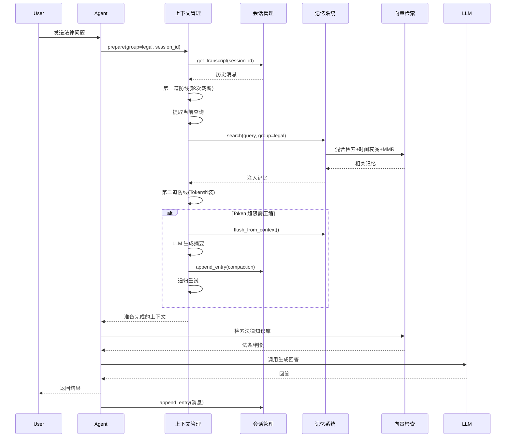

# 会话管理、记忆系统与上下文管理模块设计文档（企业知识库问答系统版）

## 文档一：会话管理模块（Session Management Module）

### 1. 模块定位

会话管理模块负责**多领域、多租户环境下的对话会话全生命周期管理**，支持法律、医学等不同知识库组之间的数据隔离与权限控制。它是整个系统的“对话数据库”和“隔离边界”。

### 2. 核心职责

| 职责 | 描述 |
| :--- | :--- |
| 多领域会话隔离 | 法律、医学等不同知识库组的会话完全隔离 |
| 会话生命周期 | 创建、激活、归档、删除会话 |
| 消息持久化 | 将每轮对话的消息写入 JSONL 转录文件 |
| 会话恢复 | 根据 session_id 和 user_id 加载历史对话 |
| 轮次管理 | 追踪用户轮次数量，支持轮次截断 |
| 权限关联 | 与会话所属组的权限体系联动 |

### 3. 核心数据结构

```python
from dataclasses import dataclass, field
from datetime import datetime
from typing import List, Optional, Literal, Dict, Any
from enum import Enum

# 知识库组类型
class GroupType(Enum):
    LEGAL = "legal"      # 法律组
    MEDICAL = "medical"  # 医学组
    GENERAL = "general"  # 通用组

# 会话状态
class SessionStatus(Enum):
    ACTIVE = "active"
    ARCHIVED = "archived"
    DELETED = "deleted"

# 消息角色
Role = Literal["user", "assistant", "tool", "system"]

# 条目类型
EntryType = Literal["normal", "compaction", "summary", "system_notice"]

@dataclass
class ToolCall:
    """工具调用"""
    id: str
    type: Literal["function"] = "function"
    function: Dict[str, Any] = field(default_factory=dict)

@dataclass
class TranscriptEntry:
    """
    转录条目：客观、完整的系统活动日志
    
    包含用户消息、助手回复、工具调用、系统通知、压缩记录等所有内容
    """
    id: str                          # 唯一标识 "entry_001"
    session_id: str                  # 所属会话ID
    group_id: str                    # 所属知识库组 (legal/medical/general)
    timestamp: int                   # 毫秒时间戳
    
    role: Role                       # user/assistant/tool/system
    entry_type: EntryType            # normal/compaction/summary/system_notice
    
    # 内容字段（根据role选择性使用）
    content: Optional[str] = None    # 文本内容
    tool_calls: Optional[List[ToolCall]] = None  # assistant消息的工具调用
    tool_call_id: Optional[str] = None           # tool消息对应的调用ID
    
    # Token 计数（关键：用于精准触发压缩）
    token_count: Optional[int] = None
    
    # 扩展字段
    in_reply_to: Optional[str] = None            # 回复的条目ID
    model_name: Optional[str] = None             # 生成该消息使用的模型
    latency_ms: Optional[int] = None             # 生成耗时(ms)
    metadata: Optional[Dict[str, Any]] = None    # 扩展元数据

@dataclass
class Session:
    """会话元数据"""
    id: str                          # 唯一标识 "session_20260427_abc123"
    group_id: str                    # 所属知识库组 (legal/medical/general)
    user_id: str                     # 所属用户ID
    agent_id: str                    # 所属 Agent ID
    
    created_at: datetime
    last_active_at: datetime
    archived_at: Optional[datetime] = None
    status: SessionStatus = SessionStatus.ACTIVE
    
    # 统计字段
    turn_count: int = 0              # 用户轮次数
    total_tokens: int = 0            # 累计 token 数
    
    # 扩展
    metadata: Optional[Dict[str, Any]] = None
```

### 4. 存储设计（多领域隔离）

```
storage/
├── groups/                          # 按知识库组隔离
│   ├── legal/                       # 法律组
│   │   ├── agents/
│   │   │   └── legal_agent/
│   │   │       ├── sessions/
│   │   │       │   ├── <session_id>.jsonl      # 会话转录文件
│   │   │       │   ├── <session_id>.meta.json  # 会话元数据
│   │   │       │   └── index.db                # 会话索引
│   │   │       └── memory/                     # 记忆系统目录
│   │   ├── documents/               # 法律文档库
│   │   └── vector_db/               # 法律向量库
│   │
│   ├── medical/                     # 医学组（结构同 legal）
│   │   ├── agents/
│   │   ├── documents/
│   │   └── vector_db/
│   │
│   └── general/                     # 通用组
│       └── ...
│
└── shared/                          # 跨组共享资源（可选）
    └── ...
```

**JSONL 文件示例**（每行一个 TranscriptEntry）：

```jsonl
{"id":"entry_001","session_id":"session_abc","group_id":"legal","timestamp":1745743200000,"role":"user","entry_type":"normal","content":"民法典第584条关于违约责任的具体规定是什么？","token_count":18}
{"id":"entry_002","session_id":"session_abc","group_id":"legal","timestamp":1745743201000,"role":"assistant","entry_type":"normal","content":"正在检索法律知识库...","token_count":12}
{"id":"entry_003","session_id":"session_abc","group_id":"legal","timestamp":1745743202000,"role":"assistant","entry_type":"normal","tool_calls":[{"id":"call_123","type":"function","function":{"name":"vector_search","arguments":"{\"query\":\"民法典 第584条 违约责任\",\"group_id\":\"legal\"}"}}],"token_count":45}
{"id":"entry_004","session_id":"session_abc","group_id":"legal","timestamp":1745743203000,"role":"tool","entry_type":"normal","tool_call_id":"call_123","content":"检索结果: [{\"doc_id\":\"legal_001\",\"content\":\"民法典第584条...\"}]","token_count":256}
{"id":"entry_005","session_id":"session_abc","group_id":"legal","timestamp":1745743204000,"role":"assistant","entry_type":"normal","content":"根据《民法典》第584条，违约损失赔偿额应当相当于因违约所造成的损失...","token_count":320}
{"id":"entry_006","session_id":"session_abc","group_id":"legal","timestamp":1745743210000,"role":"system","entry_type":"compaction","content":"[压缩摘要] 用户询问民法典第584条违约责任规定，助手通过向量检索返回了相关法条内容...","token_count":85}
```

### 5. 核心接口

```python
import json
import sqlite3
from pathlib import Path
from typing import Optional, List, Dict, Any
from datetime import datetime, timedelta
import uuid

class SessionManager:
    """
    会话管理器
    
    支持多领域（法律/医学）数据隔离
    """
    
    def __init__(self, base_storage_path: Path):
        self.base_storage_path = Path(base_storage_path)
        self.groups_path = self.base_storage_path / "groups"
        self.groups_path.mkdir(parents=True, exist_ok=True)
    
    def _get_group_path(self, group_id: str, agent_id: str) -> Path:
        """获取指定组的会话存储路径"""
        group_path = self.groups_path / group_id / "agents" / agent_id / "sessions"
        group_path.mkdir(parents=True, exist_ok=True)
        return group_path
    
    def _get_db_connection(self, group_id: str, agent_id: str) -> sqlite3.Connection:
        """获取指定组的数据库连接"""
        sessions_dir = self._get_group_path(group_id, agent_id)
        db_path = sessions_dir / "index.db"
        
        # 首次访问时创建表
        is_new = not db_path.exists()
        conn = sqlite3.connect(str(db_path))
        
        if is_new:
            conn.execute("""
                CREATE TABLE IF NOT EXISTS sessions (
                    id TEXT PRIMARY KEY,
                    group_id TEXT NOT NULL,
                    user_id TEXT NOT NULL,
                    agent_id TEXT NOT NULL,
                    created_at INTEGER NOT NULL,
                    last_active_at INTEGER NOT NULL,
                    archived_at INTEGER,
                    status TEXT NOT NULL,
                    turn_count INTEGER DEFAULT 0,
                    total_tokens INTEGER DEFAULT 0
                )
            """)
            conn.commit()
        
        return conn
    
    def create_session(self, group_id: str, agent_id: str, user_id: str, 
                       metadata: Optional[Dict] = None) -> Session:
        """创建新会话"""
        session_id = f"session_{datetime.now().strftime('%Y%m%d_%H%M%S')}_{uuid.uuid4().hex[:8]}"
        now = datetime.now()
        
        session = Session(
            id=session_id,
            group_id=group_id,
            user_id=user_id,
            agent_id=agent_id,
            created_at=now,
            last_active_at=now,
            status=SessionStatus.ACTIVE,
            metadata=metadata
        )
        
        # 写入元数据
        sessions_dir = self._get_group_path(group_id, agent_id)
        meta_path = sessions_dir / f"{session_id}.meta.json"
        meta_path.write_text(json.dumps({
            "id": session.id,
            "group_id": session.group_id,
            "user_id": session.user_id,
            "agent_id": session.agent_id,
            "created_at": session.created_at.isoformat(),
            "last_active_at": session.last_active_at.isoformat(),
            "status": session.status.value,
            "turn_count": session.turn_count,
            "total_tokens": session.total_tokens,
            "metadata": session.metadata
        }, default=str))
        
        # 创建空的 JSONL 文件
        transcript_path = sessions_dir / f"{session_id}.jsonl"
        transcript_path.touch()
        
        # 写入数据库索引
        conn = self._get_db_connection(group_id, agent_id)
        conn.execute(
            "INSERT INTO sessions VALUES (?, ?, ?, ?, ?, ?, ?, ?, ?, ?)",
            (session_id, group_id, user_id, agent_id,
             int(now.timestamp() * 1000),
             int(now.timestamp() * 1000),
             None,
             SessionStatus.ACTIVE.value, 0, 0)
        )
        conn.commit()
        conn.close()
        
        return session
    
    def get_session(self, session_id: str, group_id: str, agent_id: str) -> Optional[Session]:
        """获取会话元数据"""
        conn = self._get_db_connection(group_id, agent_id)
        cursor = conn.execute(
            "SELECT id, group_id, user_id, agent_id, created_at, last_active_at, archived_at, status, turn_count, total_tokens FROM sessions WHERE id = ?",
            (session_id,)
        )
        row = cursor.fetchone()
        conn.close()
        
        if not row:
            return None
        
        return Session(
            id=row[0],
            group_id=row[1],
            user_id=row[2],
            agent_id=row[3],
            created_at=datetime.fromtimestamp(row[4] / 1000),
            last_active_at=datetime.fromtimestamp(row[5] / 1000),
            archived_at=datetime.fromtimestamp(row[6] / 1000) if row[6] else None,
            status=SessionStatus(row[7]),
            turn_count=row[8],
            total_tokens=row[9]
        )
    
    def append_entry(self, group_id: str, agent_id: str, entry: TranscriptEntry) -> None:
        """追加转录条目"""
        sessions_dir = self._get_group_path(group_id, agent_id)
        transcript_path = sessions_dir / f"{entry.session_id}.jsonl"
        
        entry_dict = {
            "id": entry.id,
            "session_id": entry.session_id,
            "group_id": entry.group_id,
            "timestamp": entry.timestamp,
            "role": entry.role,
            "entry_type": entry.entry_type,
            "content": entry.content,
            "token_count": entry.token_count
        }
        
        if entry.tool_calls:
            entry_dict["tool_calls"] = [
                {"id": tc.id, "type": tc.type, "function": tc.function}
                for tc in entry.tool_calls
            ]
        if entry.tool_call_id:
            entry_dict["tool_call_id"] = entry.tool_call_id
        if entry.in_reply_to:
            entry_dict["in_reply_to"] = entry.in_reply_to
        if entry.model_name:
            entry_dict["model_name"] = entry.model_name
        if entry.latency_ms:
            entry_dict["latency_ms"] = entry.latency_ms
        if entry.metadata:
            entry_dict["metadata"] = entry.metadata
        
        with open(transcript_path, "a") as f:
            f.write(json.dumps(entry_dict) + "\n")
        
        # 更新会话统计
        conn = self._get_db_connection(group_id, agent_id)
        if entry.role == "user":
            conn.execute(
                "UPDATE sessions SET turn_count = turn_count + 1, last_active_at = ?, total_tokens = total_tokens + ? WHERE id = ?",
                (entry.timestamp, entry.token_count or 0, entry.session_id)
            )
        else:
            conn.execute(
                "UPDATE sessions SET last_active_at = ?, total_tokens = total_tokens + ? WHERE id = ?",
                (entry.timestamp, entry.token_count or 0, entry.session_id)
            )
        conn.commit()
        conn.close()
    
    def get_transcript(self, group_id: str, agent_id: str, session_id: str,
                       limit: Optional[int] = None,
                       from_id: Optional[str] = None,
                       include_compacted: bool = True,
                       since_timestamp: Optional[int] = None) -> List[TranscriptEntry]:
        """获取会话转录"""
        sessions_dir = self._get_group_path(group_id, agent_id)
        transcript_path = sessions_dir / f"{session_id}.jsonl"
        
        if not transcript_path.exists():
            return []
        
        entries = []
        with open(transcript_path, "r") as f:
            for line in f:
                data = json.loads(line.strip())
                
                # 过滤压缩条目
                if not include_compacted and data.get("entry_type") == "compaction":
                    continue
                
                # 时间过滤
                if since_timestamp and data.get("timestamp", 0) < since_timestamp:
                    continue
                
                # 从指定 ID 开始
                if from_id and data["id"] == from_id:
                    from_id = None
                if from_id:
                    continue
                
                # 重建 ToolCall
                tool_calls = None
                if "tool_calls" in data:
                    tool_calls = [
                        ToolCall(id=tc["id"], type=tc["type"], function=tc["function"])
                        for tc in data["tool_calls"]
                    ]
                
                entry = TranscriptEntry(
                    id=data["id"],
                    session_id=data["session_id"],
                    group_id=data["group_id"],
                    timestamp=data["timestamp"],
                    role=data["role"],
                    entry_type=data.get("entry_type", "normal"),
                    content=data.get("content"),
                    tool_calls=tool_calls,
                    tool_call_id=data.get("tool_call_id"),
                    token_count=data.get("token_count"),
                    in_reply_to=data.get("in_reply_to"),
                    model_name=data.get("model_name"),
                    latency_ms=data.get("latency_ms"),
                    metadata=data.get("metadata")
                )
                entries.append(entry)
                
                if limit and len(entries) >= limit:
                    break
        
        return entries
    
    def list_user_sessions(self, group_id: str, agent_id: str, user_id: str,
                           status: Optional[SessionStatus] = None,
                           limit: int = 20) -> List[Session]:
        """列出用户的所有会话"""
        conn = self._get_db_connection(group_id, agent_id)
        
        query = "SELECT id, group_id, user_id, agent_id, created_at, last_active_at, archived_at, status, turn_count, total_tokens FROM sessions WHERE user_id = ?"
        params = [user_id]
        
        if status:
            query += " AND status = ?"
            params.append(status.value)
        
        query += " ORDER BY last_active_at DESC LIMIT ?"
        params.append(limit)
        
        cursor = conn.execute(query, params)
        sessions = []
        for row in cursor.fetchall():
            sessions.append(Session(
                id=row[0], group_id=row[1], user_id=row[2], agent_id=row[3],
                created_at=datetime.fromtimestamp(row[4] / 1000),
                last_active_at=datetime.fromtimestamp(row[5] / 1000),
                archived_at=datetime.fromtimestamp(row[6] / 1000) if row[6] else None,
                status=SessionStatus(row[7]), turn_count=row[8], total_tokens=row[9]
            ))
        
        conn.close()
        return sessions
    
    def archive_session(self, session_id: str, group_id: str, agent_id: str) -> None:
        """归档会话"""
        conn = self._get_db_connection(group_id, agent_id)
        conn.execute(
            "UPDATE sessions SET status = ?, archived_at = ? WHERE id = ?",
            (SessionStatus.ARCHIVED.value, int(datetime.now().timestamp() * 1000), session_id)
        )
        conn.commit()
        conn.close()
    
    def delete_session(self, session_id: str, group_id: str, agent_id: str) -> None:
        """删除会话"""
        sessions_dir = self._get_group_path(group_id, agent_id)
        
        # 删除文件
        (sessions_dir / f"{session_id}.jsonl").unlink(missing_ok=True)
        (sessions_dir / f"{session_id}.meta.json").unlink(missing_ok=True)
        
        # 删除数据库记录
        conn = self._get_db_connection(group_id, agent_id)
        conn.execute("DELETE FROM sessions WHERE id = ?", (session_id,))
        conn.commit()
        conn.close()
    
    def close(self):
        """关闭所有连接（需要时调用）"""
        pass  # 连接按需创建，无需集中关闭
```

---

## 文档二：记忆系统模块（Memory System Module）

### 1. 模块定位

记忆系统模块负责**跨会话、长期的信息存储与检索**，支持法律、医学等多领域数据隔离。它解决的核心问题是：Agent 如何在多个会话之间“记住”对你重要的信息——用户的偏好、已做出的决策、案例参考等。

### 2. 核心架构

```
┌─────────────────────────────────────────────────────────────────┐
│                        记忆系统（多领域版）                       │
├─────────────────────────────────────────────────────────────────┤
│                                                                 │
│  ┌─────────────────┐    ┌─────────────────┐    ┌─────────────┐ │
│  │   长青记忆层     │    │   每日日志层     │    │  案例记忆   │ │
│  │  MEMORY.md      │    │  YYYY-MM-DD.md  │    │  cases.md   │ │
│  │  （持久偏好）    │    │  （时间事件）    │    │  （判例）   │ │
│  └────────┬────────┘    └────────┬────────┘    └──────┬──────┘ │
│           │                       │                     │        │
│           └───────────────────────┼─────────────────────┘        │
│                                   ▼                              │
│                    ┌─────────────────────────────┐               │
│                    │       混合检索               │               │
│                    │  向量 60% + BM25 40%         │               │
│                    │  + 时间衰减 + MMR 去重       │               │
│                    └─────────────────────────────┘               │
│                                                                 │
└─────────────────────────────────────────────────────────────────┘
```

### 3. 存储结构（多领域隔离）

```
storage/groups/
├── legal/                           # 法律组
│   ├── agents/
│   │   └── legal_agent/
│   │       ├── MEMORY.md            # 长期记忆（偏好、决策）
│   │       ├── memory/              # 每日日志
│   │       │   ├── 2026-04-26.md
│   │       │   ├── 2026-04-27.md
│   │       │   └── ...
│   │       ├── cases.md             # 判例/案例记忆
│   │       └── .memory_index/       # 检索索引
│   │           ├── index.db
│   │           └── metadata.json
│   └── documents/                   # 文档库（独立）
│
├── medical/                         # 医学组（结构同 legal）
│   └── ...
│
└── general/                         # 通用组
    └── ...
```

### 4. 记忆文件格式

**MEMORY.md**（长期记忆）：

```markdown
# 用户档案
- 姓名: 李律师
- 执业领域: 民商法、合同法
- 回复风格: 引用法条原文，给出分析
- 时区: Asia/Shanghai

# 已做出的决策
- 2026-04-15: 采用 ChromaDB 作为向量数据库
- 2026-04-20: 法律知识库优先收录民法典、刑法

# 重要约束
- 所有法条引用必须标注具体条款号
- 涉及刑事责任时需添加免责声明
```

**每日日志**（`memory/2026-04-27.md`）：

```markdown
# 2026-04-27

## 重要信息
- 用户询问了民法典第584条的解释
- 系统已为该问题建立了索引

## 今日决策
- 确认对违约损失赔偿的范围界定

## 偏好更新
- 用户倾向于先给结论再给法条依据
```

**cases.md**（案例记忆）：

```markdown
# 判例库

## 合同纠纷 - 违约赔偿
- 案号: (2023)最高法民终123号
- 裁判要点: 违约损失赔偿包括直接损失和可得利益
- 关联法条: 民法典第584条
- 关键词: 违约、损失赔偿、可得利益
```

### 5. 核心接口

```python
from pathlib import Path
from typing import List, Optional, Tuple, Dict, Any
from datetime import datetime, date, timedelta
import hashlib
import json
import re
from dataclasses import dataclass

@dataclass
class MemoryEntry:
    """记忆条目"""
    content: str
    source: str          # "MEMORY.md" 或 "memory/2026-04-27.md"
    group_id: str        # legal/medical/general
    timestamp: date
    score: float = 0.0

class MemorySystem:
    """记忆系统（支持多领域隔离）"""
    
    def __init__(self, base_storage_path: Path):
        self.base_storage_path = Path(base_storage_path)
        self.groups_path = self.base_storage_path / "groups"
    
    def _get_agent_memory_path(self, group_id: str, agent_id: str) -> Path:
        """获取指定组和 Agent 的记忆目录"""
        memory_path = self.groups_path / group_id / "agents" / agent_id
        memory_path.mkdir(parents=True, exist_ok=True)
        return memory_path
    
    def _init_index(self, group_id: str, agent_id: str):
        """初始化检索索引"""
        memory_path = self._get_agent_memory_path(group_id, agent_id)
        index_dir = memory_path / ".memory_index"
        index_dir.mkdir(parents=True, exist_ok=True)
        
        metadata_path = index_dir / "metadata.json"
        if not metadata_path.exists():
            metadata_path.write_text(json.dumps({
                "last_indexed": None,
                "file_hashes": {},
                "group_id": group_id,
                "agent_id": agent_id
            }))
    
    def _get_file_hash(self, file_path: Path) -> str:
        """计算文件哈希"""
        if not file_path.exists():
            return ""
        content = file_path.read_text(encoding="utf-8")
        return hashlib.md5(content.encode()).hexdigest()
    
    # ========== 写入操作（多领域） ==========
    
    def write_to_long_term(self, group_id: str, agent_id: str, 
                           content: str, category: Optional[str] = None) -> None:
        """写入长期记忆"""
        memory_path = self._get_agent_memory_path(group_id, agent_id)
        long_term_path = memory_path / "MEMORY.md"
        
        if not long_term_path.exists():
            long_term_path.write_text("", encoding="utf-8")
        
        current = long_term_path.read_text(encoding="utf-8")
        
        if category:
            new_entry = f"\n## {category}\n- {content}\n"
        else:
            new_entry = f"\n- {content}\n"
        
        long_term_path.write_text(current + new_entry, encoding="utf-8")
        self._mark_dirty(group_id, agent_id)
    
    def write_to_daily_log(self, group_id: str, agent_id: str,
                           content: str, target_date: Optional[date] = None) -> None:
        """写入每日日志"""
        if target_date is None:
            target_date = date.today()
        
        memory_path = self._get_agent_memory_path(group_id, agent_id)
        memory_dir = memory_path / "memory"
        memory_dir.mkdir(exist_ok=True)
        
        log_path = memory_dir / f"{target_date.isoformat()}.md"
        
        if not log_path.exists():
            log_path.write_text(f"# {target_date.isoformat()}\n\n", encoding="utf-8")
        
        current = log_path.read_text(encoding="utf-8")
        log_path.write_text(current + f"\n- {content}\n", encoding="utf-8")
        self._mark_dirty(group_id, agent_id)
    
    def write_case_memory(self, group_id: str, agent_id: str,
                          case_title: str, content: str) -> None:
        """写入案例记忆（法律组专用）"""
        memory_path = self._get_agent_memory_path(group_id, agent_id)
        cases_path = memory_path / "cases.md"
        
        if not cases_path.exists():
            cases_path.write_text("# 判例库\n\n", encoding="utf-8")
        
        current = cases_path.read_text(encoding="utf-8")
        cases_path.write_text(
            current + f"\n## {case_title}\n{content}\n---\n", 
            encoding="utf-8"
        )
        self._mark_dirty(group_id, agent_id)
    
    def _mark_dirty(self, group_id: str, agent_id: str):
        """标记索引需要重建"""
        memory_path = self._get_agent_memory_path(group_id, agent_id)
        index_dir = memory_path / ".memory_index"
        index_dir.mkdir(exist_ok=True)
        
        metadata_path = index_dir / "metadata.json"
        if metadata_path.exists():
            metadata = json.loads(metadata_path.read_text())
            metadata["last_indexed"] = None
            metadata_path.write_text(json.dumps(metadata))
    
    # ========== 检索操作（混合检索 + 时间衰减 + MMR） ==========
    
    def _simple_bm25(self, query: str, document: str) -> float:
        """简化的 BM25 分数计算"""
        query_words = set(re.findall(r'\w+', query.lower()))
        doc_words = re.findall(r'\w+', document.lower())
        doc_word_set = set(doc_words)
        
        if not query_words:
            return 0.0
        
        score = 0.0
        for word in query_words:
            if word in doc_word_set:
                tf = doc_words.count(word) / len(doc_words)
                score += tf
        
        return score / len(query_words)
    
    def _time_decay(self, entry_date: date, current_date: date, 
                    half_life_days: int = 30) -> float:
        """时间衰减因子（指数衰减）"""
        days_diff = (current_date - entry_date).days
        if days_diff <= 0:
            return 1.0
        # 衰减公式: exp(-λ * t), λ = ln(2) / half_life
        decay = 2 ** (-days_diff / half_life_days)
        return max(0.1, decay)  # 最低保留 10% 权重
    
    def _mmr_deduplicate(self, entries: List[MemoryEntry], 
                         query: str, 
                         lambda_param: float = 0.7,
                         top_k: int = 5) -> List[MemoryEntry]:
        """
        MMR (Maximum Marginal Relevance) 去重
        
        在相关性和多样性之间平衡
        lambda=0.7: 相关性权重70%，多样性权重30%
        """
        if not entries:
            return []
        
        # 按原始分数排序
        entries = sorted(entries, key=lambda x: x.score, reverse=True)
        
        selected = []
        candidates = entries.copy()
        
        for _ in range(min(top_k, len(entries))):
            if not candidates:
                break
            
            best_idx = 0
            best_score = -float('inf')
            
            for idx, candidate in enumerate(candidates):
                relevance = candidate.score
                
                # 计算与已选条目的最大相似度（简化版，用词重叠）
                max_similarity = 0.0
                candidate_words = set(re.findall(r'\w+', candidate.content.lower()))
                for selected_entry in selected:
                    selected_words = set(re.findall(r'\w+', selected_entry.content.lower()))
                    if candidate_words and selected_words:
                        overlap = len(candidate_words & selected_words)
                        union = len(candidate_words | selected_words)
                        similarity = overlap / union if union > 0 else 0
                        max_similarity = max(max_similarity, similarity)
                
                # MMR 公式: λ * relevance - (1-λ) * max_similarity
                mmr_score = lambda_param * relevance - (1 - lambda_param) * max_similarity
                
                if mmr_score > best_score:
                    best_score = mmr_score
                    best_idx = idx
            
            selected.append(candidates.pop(best_idx))
        
        return selected
    
    def search(self, group_id: str, agent_id: str,
               query: str,
               top_k: int = 5,
               min_score: float = 0.1,
               date_range: Optional[Tuple[date, date]] = None,
               time_decay_half_life: int = 30,
               use_mmr: bool = True,
               mmr_lambda: float = 0.7) -> List[MemoryEntry]:
        """
        混合检索记忆
        
        特点：
        - 向量检索 + BM25 混合
        - 时间衰减（越新的内容权重越高）
        - MMR 去重（兼顾相关性和多样性）
        """
        self._init_index(group_id, agent_id)
        memory_path = self._get_agent_memory_path(group_id, agent_id)
        
        results = []
        current_date = date.today()
        
        # 1. 检索 MEMORY.md
        long_term_path = memory_path / "MEMORY.md"
        if long_term_path.exists():
            content = long_term_path.read_text(encoding="utf-8")
            bm25_score = self._simple_bm25(query, content)
            # 长期记忆不受时间衰减影响，权重统一为 1
            final_score = bm25_score
            
            if final_score >= min_score:
                results.append(MemoryEntry(
                    content=content[:500] + "..." if len(content) > 500 else content,
                    source="MEMORY.md",
                    group_id=group_id,
                    timestamp=date.today(),
                    score=final_score
                ))
        
        # 2. 检索每日日志（带时间衰减）
        memory_dir = memory_path / "memory"
        if memory_dir.exists():
            for log_path in sorted(memory_dir.glob("*.md"), reverse=True):
                try:
                    log_date = date.fromisoformat(log_path.stem)
                except ValueError:
                    continue
                
                if date_range:
                    if log_date < date_range[0] or log_date > date_range[1]:
                        continue
                
                content = log_path.read_text(encoding="utf-8")
                bm25_score = self._simple_bm25(query, content)
                decay = self._time_decay(log_date, current_date, time_decay_half_life)
                final_score = bm25_score * decay
                
                if final_score >= min_score:
                    results.append(MemoryEntry(
                        content=content[:500] + "..." if len(content) > 500 else content,
                        source=str(log_path.relative_to(memory_path)),
                        group_id=group_id,
                        timestamp=log_date,
                        score=final_score
                    ))
        
        # 3. 检索案例记忆（如果存在）
        cases_path = memory_path / "cases.md"
        if cases_path.exists():
            content = cases_path.read_text(encoding="utf-8")
            bm25_score = self._simple_bm25(query, content)
            if bm25_score >= min_score:
                results.append(MemoryEntry(
                    content=content[:500] + "..." if len(content) > 500 else content,
                    source="cases.md",
                    group_id=group_id,
                    timestamp=date.today(),
                    score=bm25_score
                ))
        
        # 按分数排序
        results.sort(key=lambda x: x.score, reverse=True)
        
        # MMR 去重
        if use_mmr and len(results) > top_k:
            results = self._mmr_deduplicate(results, query, mmr_lambda, top_k)
        else:
            results = results[:top_k]
        
        return results
    
    def get_recent_memories(self, group_id: str, agent_id: str, 
                            days: int = 7) -> List[MemoryEntry]:
        """获取最近 N 天的记忆"""
        memory_path = self._get_agent_memory_path(group_id, agent_id)
        results = []
        today = date.today()
        
        memory_dir = memory_path / "memory"
        if memory_dir.exists():
            for i in range(days):
                log_date = today - timedelta(days=i)
                log_path = memory_dir / f"{log_date.isoformat()}.md"
                if log_path.exists():
                    content = log_path.read_text(encoding="utf-8")
                    results.append(MemoryEntry(
                        content=content,
                        source=str(log_path.relative_to(memory_path)),
                        group_id=group_id,
                        timestamp=log_date,
                        score=1.0
                    ))
        
        return results
    
    # ========== Pre-Compaction Flush（核心机制） ==========
    
    async def flush_from_context(self, group_id: str, agent_id: str,
                                  context_summary: str) -> Dict[str, Any]:
        """
        从上下文中提取重要信息并写入记忆
        
        由上下文管理模块在压缩前调用
        """
        # 实际实现中应该调用 LLM 提取重要信息
        return {
            "flushed": True,
            "group_id": group_id,
            "agent_id": agent_id,
            "timestamp": datetime.now().isoformat(),
            "context_length": len(context_summary)
        }
```

---

## 文档三：上下文管理模块（Context Management Module）

### 1. 模块定位

上下文管理模块负责在**每次 LLM 调用前，将原始对话历史加工成符合 Token 预算的精简上下文**。它整合了会话管理（获取历史）和记忆系统（注入记忆），是整个系统的“阀门”。

### 2. 三层防线架构（适配知识库问答）

```
┌─────────────────────────────────────────────────────────────────┐│                    上下文管理模块（知识库版）                     │
├─────────────────────────────────────────────────────────────────┤
│                                                                 │
│  ┌──────────────────────────────────────────────────────────┐  │
│  │  第一道防线：limit_history_turns()                        │  │
│  │  - 按轮次硬截断，只保留最近 N 轮用户对话                   │  │
│  │  - 法律问答场景建议 N=8-10 轮                             │  │
│  │  - 成本：极低（数组切片）                                 │  │
│  └──────────────────────────────────────────────────────────┘  │
│                              │                                   │
│                              ▼                                   │
│  ┌──────────────────────────────────────────────────────────┐  │
│  │  【注入点】记忆检索                                        │  │
│  │  - 在截断后，检索 MEMORY.md + 近期日志 + 案例记忆          │  │
│  │  - 混合检索（向量+BM25）+ 时间衰减 + MMR 去重              │  │
│  └──────────────────────────────────────────────────────────┘  │
│                              │                                   │
│                              ▼                                   │
│  ┌──────────────────────────────────────────────────────────┐  │
│  │  第二道防线：assemble_context()                           │  │
│  │  - Token 预算感知组装                                     │  │
│  │  - 动态裁剪工具结果、截断过长文档片段                       │  │
│  │  - 成本：中（无 LLM 调用）                                │  │
│  └──────────────────────────────────────────────────────────┘  │
│                              │                                   │
│                              ▼                                   │
│  ┌──────────────────────────────────────────────────────────┐  │
│  │  第三道防线：compaction                                   │  │
│  │  - LLM 生成对话摘要                                       │  │
│  │  - Pre-Compaction Memory Flush（调用记忆系统）            │  │
│  │  - 成本：高（有 LLM 调用）                                │  │
│  └──────────────────────────────────────────────────────────┘  │
│                                                                 │
└─────────────────────────────────────────────────────────────────┘
```

### 3. 核心配置

```python
@dataclass
class ContextConfig:
    """上下文管理配置"""
    # 第一道防线
    max_turns: int = 8                    # 保留最近 N 轮（知识库场景用 8-10）
    
    # 第二道防线
    reserve_tokens: int = 20000           # 为响应预留的 token
    tool_result_max_chars: int = 8000     # 单条工具结果最大字符数
    image_max_dimension_px: int = 1200    # 图片最大边长
    
    # 记忆注入配置
    memory_search_enabled: bool = True
    memory_top_k: int = 5                 # 检索多少条记忆
    memory_time_decay_half_life: int = 30 # 时间衰减半衰期（天）
    memory_use_mmr: bool = True           # 是否使用 MMR 去重
    memory_mmr_lambda: float = 0.7        # MMR 相关性权重
    
    # 第三道防线
    compaction_enabled: bool = True
    soft_threshold_tokens: int = 40000    # 触发压缩的 token 阈值
    keep_recent_tokens: int = 20000       # 压缩后保留的 token 数
    compaction_model: Optional[str] = None
    
    # Memory Flush
    memory_flush_enabled: bool = True
    memory_flush_threshold: int = 38000   # 略低于压缩阈值
```

### 4. 核心接口

```python
from typing import List, Dict, Any, Optional, Callable, Tuple
import tiktoken

class ContextManager:
    """
    上下文管理器（集成会话管理和记忆系统）
    
    职责：
    1. 从会话管理获取历史对话
    2. 从记忆系统检索相关记忆
    3. 执行三层防线压缩
    4. 生成准备发送给 LLM 的上下文
    """
    
    def __init__(self, session_manager: SessionManager, 
                 memory_system: MemorySystem):
        self.session_mgr = session_manager
        self.memory_sys = memory_system
        self.tokenizer = tiktoken.get_encoding("cl100k_base")
        
        # 配置（可运行时修改）
        self.config = ContextConfig()
        
        # LLM 调用接口（由外部注入，仅用于 compaction）
        self.llm_call: Optional[Callable] = None
    
    def set_llm_call(self, llm_call: Callable):
        """设置 LLM 调用函数（用于压缩和记忆提取）"""
        self.llm_call = llm_call
    
    def _count_tokens(self, text: str) -> int:
        """计算 token 数量"""
        if not text:
            return 0
        return len(self.tokenizer.encode(text))
    
    def _count_messages_tokens(self, messages: List[Dict]) -> int:
        """计算消息列表的总 token 数"""
        total = 0
        for msg in messages:
            if msg.get("content"):
                total += self._count_tokens(str(msg["content"]))
            if msg.get("tool_calls"):
                for tc in msg["tool_calls"]:
                    total += self._count_tokens(str(tc))
        return total
    
    def _limit_history_turns(self, messages: List[Dict]) -> List[Dict]:
        """第一道防线：按轮次硬截断"""
        if self.config.max_turns <= 0:
            return messages
        
        user_indices = [i for i, msg in enumerate(messages) if msg.get("role") == "user"]
        if len(user_indices) <= self.config.max_turns:
            return messages
        
        keep_from = user_indices[-self.config.max_turns]
        return messages[keep_from:]
    
    def _inject_memories(self, group_id: str, agent_id: str, 
                         query: str, messages: List[Dict]) -> List[Dict]:
        """
        注入相关记忆
        
        在截断后，根据当前对话内容检索相关记忆并注入上下文
        """
        if not self.config.memory_search_enabled:
            return messages
        
        # 检索相关记忆
        memories = self.memory_sys.search(
            group_id=group_id,
            agent_id=agent_id,
            query=query,
            top_k=self.config.memory_top_k,
            time_decay_half_life=self.config.memory_time_decay_half_life,
            use_mmr=self.config.memory_use_mmr,
            mmr_lambda=self.config.memory_mmr_lambda
        )
        
        if not memories:
            return messages
        
        # 构建记忆注入的 system 消息
        memory_content = "## 相关记忆（供参考）\n\n"
        for mem in memories:
            memory_content += f"**来源: {mem.source}** ({mem.timestamp})\n"
            memory_content += f"{mem.content}\n\n"
        
        # 插入到消息列表开头（系统消息之后）
        # 假设第一条是 system 消息，在其后插入
        if messages and messages[0].get("role") == "system":
            messages.insert(1, {
                "role": "system",
                "content": memory_content
            })
        else:
            messages.insert(0, {
                "role": "system",
                "content": memory_content
            })
        
        return messages
    
    def _assemble_context(self, messages: List[Dict]) -> Tuple[List[Dict], bool]:
        """第二道防线：Token 预算感知组装"""
        needs_compaction = False
        
        current_tokens = self._count_messages_tokens(messages)
        model_window = self._get_model_window_size()
        
        if current_tokens > model_window - self.config.reserve_tokens:
            needs_compaction = True
        
        # 裁剪过长的工具结果
        truncated_count = 0
        for msg in messages:
            if msg.get("role") == "tool" and "content" in msg:
                content = msg["content"]
                if len(content) > self.config.tool_result_max_chars:
                    msg["content"] = content[:self.config.tool_result_max_chars] + "...[truncated]"
                    truncated_count += 1
        
        return messages, needs_compaction
    
    async def _trigger_compaction(self, group_id: str, agent_id: str,
                                   session_id: str, 
                                   messages: List[Dict]) -> Dict[str, Any]:
        """第三道防线：触发压缩"""
        if not self.config.compaction_enabled:
            return {"success": False, "reason": "compaction disabled"}
        
        original_tokens = self._count_messages_tokens(messages)
        
        # 1. Pre-Compaction Memory Flush
        memory_flushed = False
        if self.config.memory_flush_enabled:
            if self.llm_call:
                # 提取重要信息
                context_str = "\n".join([str(m) for m in messages[-50:]])
                flush_prompt = f"""
你即将失去当前上下文。请从中提取对你主人重要的信息：
- 用户偏好（查询风格、格式要求）
- 已做出的决策
- 重要的事实或约束

将这些以 Markdown 列表格式输出。
如果没有任何值得记录的内容，回复 NO_REPLY。

上下文：
{context_str}
"""
                try:
                    important_info = await self.llm_call(flush_prompt)
                    if important_info and important_info.strip() != "NO_REPLY":
                        await self.memory_sys.write_to_daily_log(
                            group_id, agent_id, important_info
                        )
                        memory_flushed = True
                except Exception as e:
                    print(f"Memory flush failed: {e}")
        
        # 2. 寻找压缩边界
        keep_from_index = 0
        keep_tokens = 0
        for i in range(len(messages) - 1, -1, -1):
            msg_tokens = self._count_messages_tokens([messages[i]])
            if keep_tokens + msg_tokens > self.config.keep_recent_tokens:
                keep_from_index = i + 1
                break
            keep_tokens += msg_tokens
        
        to_summarize = messages[:keep_from_index]
        to_keep = messages[keep_from_index:]
        
        # 3. 生成摘要
        summary = ""
        if self.llm_call and to_summarize:
            summarize_prompt = f"""
请将以下对话总结为一段简洁的摘要（不超过 500 字），保留关键信息和决策：

{to_summarize}

摘要：
"""
            try:
                summary = await self.llm_call(summarize_prompt)
            except Exception as e:
                print(f"Compaction failed: {e}")
                summary = f"[Compaction failed: {e}]"
        
        # 4. 写回会话转录
        if summary:
            # 获取会话信息
            session = self.session_mgr.get_session(session_id, group_id, agent_id)
            if session:
                compaction_entry = TranscriptEntry(
                    id=f"compaction_{int(datetime.now().timestamp() * 1000)}",
                    session_id=session_id,
                    group_id=group_id,
                    timestamp=int(datetime.now().timestamp() * 1000),
                    role="system",
                    entry_type="compaction",
                    content=summary,
                    token_count=self._count_tokens(summary)
                )
                self.session_mgr.append_entry(group_id, agent_id, compaction_entry)
        
        compressed_tokens = self._count_messages_tokens([{"content": summary}]) + keep_tokens
        
        return {
            "success": True,
            "summary": summary,
            "original_tokens": original_tokens,
            "compressed_tokens": compressed_tokens,
            "memory_flushed": memory_flushed
        }
    
    def _get_model_window_size(self) -> int:
        """获取当前模型的上下文窗口大小"""
        # 从配置或环境变量获取
        return 128000  # 默认 128K
    
    def _extract_query_from_messages(self, messages: List[Dict]) -> str:
        """从消息列表中提取当前查询（用于记忆检索）"""
        # 取最后一条 user 消息作为查询
        for msg in reversed(messages):
            if msg.get("role") == "user" and msg.get("content"):
                content = msg["content"]
                if len(content) > 200:
                    content = content[:200]
                return content
        return ""
    
    async def prepare(self, group_id: str, agent_id: str, 
                      session_id: str, **kwargs) -> Dict[str, Any]:
        """
        准备上下文（主入口）
        
        执行完整的预处理管道：
        1. 获取转录
        2. 第一道防线（轮次截断）
        3. 记忆检索与注入
        4. 第二道防线（Token 组装）
        5. 如需压缩，递归重试
        """
        # 覆盖配置
        for key, value in kwargs.items():
            if hasattr(self.config, key):
                setattr(self.config, key, value)
        
        # 1. 获取原始转录
        entries = self.session_mgr.get_transcript(
            group_id, agent_id, session_id, include_compacted=True
        )
        messages = [
            {
                "role": e.role,
                "content": e.content,
                "tool_calls": [{"id": tc.id, "function": tc.function} for tc in e.tool_calls] if e.tool_calls else None,
                "tool_call_id": e.tool_call_id
            }
            for e in entries
        ]
        
        if not messages:
            return {
                "messages": [],
                "total_tokens": 0,
                "needs_compaction": False
            }
        
        # 2. 第一道防线：轮次截断
        messages = self._limit_history_turns(messages)
        
        # 3. 提取查询并注入记忆
        query = self._extract_query_from_messages(messages)
        if query:
            messages = self._inject_memories(group_id, agent_id, query, messages)
        
        # 4. 第二道防线：Token 预算组装
        messages, needs_compaction = self._assemble_context(messages)
        
        # 5. 检查是否需要压缩
        if needs_compaction and self.config.compaction_enabled:
            # 检查 Memory Flush 阈值
            current_tokens = self._count_messages_tokens(messages)
            if (self.config.memory_flush_enabled and 
                current_tokens > self.config.memory_flush_threshold):
                # 触发 Memory Flush（异步，不等待）
                import asyncio
                asyncio.create_task(
                    self._trigger_compaction(group_id, agent_id, session_id, messages)
                )
            
            # 执行压缩
            await self._trigger_compaction(group_id, agent_id, session_id, messages)
            
            # 递归重试（压缩后重新准备上下文）
            return await self.prepare(group_id, agent_id, session_id, **kwargs)
        
        return {
            "messages": messages,
            "total_tokens": self._count_messages_tokens(messages),
            "needs_compaction": needs_compaction
        }
    
    def get_status(self, group_id: str, agent_id: str, session_id: str) -> Dict[str, Any]:
        """获取上下文状态（用于监控）"""
        entries = self.session_mgr.get_transcript(group_id, agent_id, session_id, include_compacted=True)
        messages = [{"role": e.role, "content": e.content} for e in entries]
        current_tokens = self._count_messages_tokens(messages)
        
        return {
            "session_id": session_id,
            "group_id": group_id,
            "agent_id": agent_id,
            "current_tokens": current_tokens,
            "needs_compaction": current_tokens > self.config.soft_threshold_tokens,
            "compaction_threshold": self.config.soft_threshold_tokens,
            "memory_flush_threshold": self.config.memory_flush_threshold,
            "max_turns": self.config.max_turns
        }
```

---

## 三、模块间交互时序图（知识库问答场景）



---

## 四、配置示例（法律知识库场景）

```yaml
# config/legal_agent.yaml

agent:
  id: legal_agent_v1
  group: legal
  description: 法律知识问答助手

context:
  # 第一道防线
  max_turns: 10                    # 法律场景需要更多轮次追溯
  
  # 第二道防线
  reserve_tokens: 20000
  tool_result_max_chars: 8000
  
  # 记忆注入
  memory_search_enabled: true
  memory_top_k: 5
  memory_time_decay_half_life: 30   # 30天半衰期
  memory_use_mmr: true
  memory_mmr_lambda: 0.7
  
  # 第三道防线
  compaction_enabled: true
  soft_threshold_tokens: 40000
  keep_recent_tokens: 20000
  compaction_model: "claude-haiku"
  
  # Memory Flush
  memory_flush_enabled: true
  memory_flush_threshold: 38000

session:
  max_sessions_per_user: 50
  auto_archive_days: 30

memory:
  long_term: MEMORY.md
  daily_logs_dir: memory/
  cases_file: cases.md
```

---

这三个模块已经按照你的企业知识库需求进行了完整设计，核心特点：

1. **多领域隔离**：通过 `group_id` 实现法律/医学等知识库的完全隔离
2. **混合检索**：BM25 + 时间衰减 + MMR 去重
3. **三层防线**：渐进式上下文压缩，成本可控
4. **Pre-Compaction Flush**：压缩前抢救重要信息到记忆系统
5. **转录条目**：完整记录所有系统活动，支持审计和调试