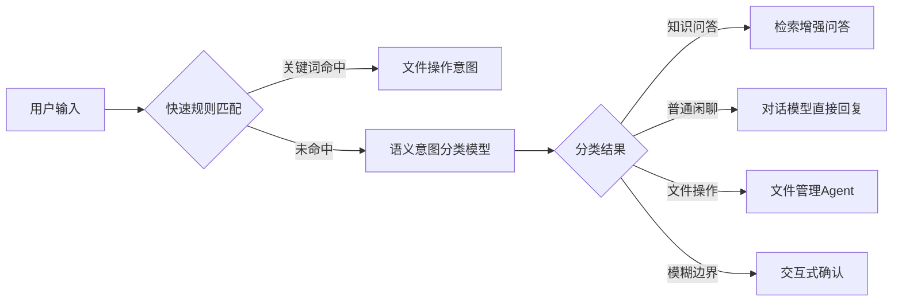
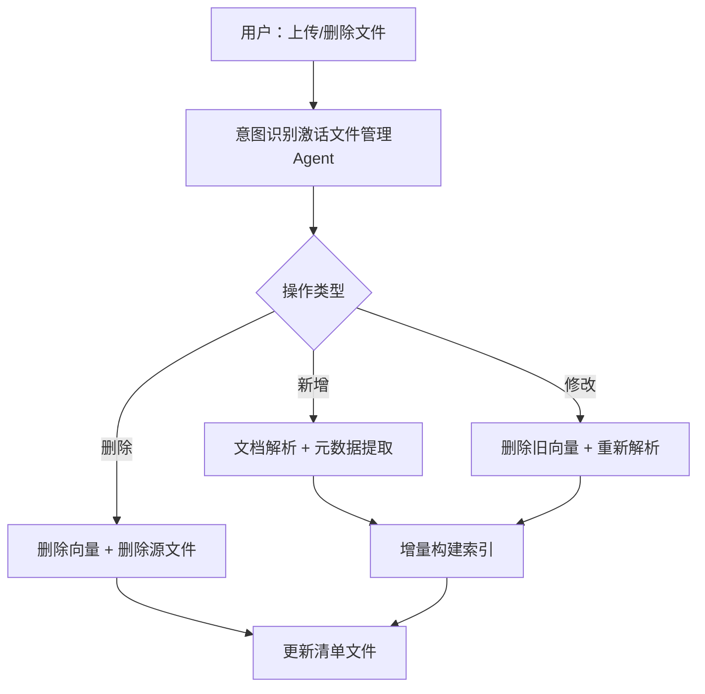

1.我现在要搭建法律知识库系统，后面还可能增加医学的，或者更多，这些知识对应不同组，实现数据隔离，并且切分的doc也进行文件夹隔离，权限隔离；对于pdf非结构数据，doc，html都转为md进行处理？很明显pdf转为text/md处理，doc和html为有结构数据，excel结构数据使用大数据处理方法
2.意图识别：判别是知识问答还是普通询问还是文件操作，规则+语义识别
3.agent监控器
4.采用向量检索+bm25检索证据，根据时间衰减和mmr优化证据
5.文件管理agent：意图识别层进行激发，用户发出指令要求修改删除或新增，添加看板，在用户修改后增量构建索引
6.双数据库，一份构建索引的同时，另一份可以进行查询
7.会话管理
8.上下文管理
9.skill动态注入
10.每一份原始文档都构建元数据，这是预处理，若有增量文件管理agent会处理
*   **建立“清单文件”**：在 `knowledge/` 根目录维护一个 `index_manifest.json`。
    ```json
    [
      {
        "filename": "2023_Q4_Report.pdf",
        "path": "finance/2023_Q4_Report.pdf",
        "tags": ["finance", "report", "2023", "confidential"],
     “access_control”：
        "summary": "这份报告包含了Q4的营收和利润...", 
        "last_modified": "2024-01-01"
      }
    ]
    

你的系统设计思路非常清晰，已经超越了很多初级RAG方案，呈现出**企业级多租户知识库平台**的雏形。我逐条分析并补充一些实战建议：

---

## 1. 数据隔离与异构文档处理

### 数据隔离架构
你的需求涉及**多领域（法律/医学）+ 多租户（不同组）+ 多层级隔离**，建议采用三层隔离策略：

| 隔离层级 | 实现方式 | 对应你的需求 |
|---------|---------|-------------|
| **物理隔离** | 不同组的向量库/文件夹完全分离 | 文件夹隔离 |
| **逻辑隔离** | 同一向量库内通过 `namespace`/`group_id` 字段过滤 | 数据隔离 |
| **权限隔离** | RBAC + 元数据中的 `access_control` 字段 | 权限隔离 |

**推荐方案**：结合使用
```
向量数据库结构：
├── Collection: legal_knowledge  (法律组专用)
│   └── Documents + 元数据(含 access_control)
├── Collection: medical_knowledge (医学组专用)
└── Collection: common_knowledge  (共享知识)
```

### 异构文档统一处理
你的分类策略是正确的，但细节需要明确：

| 文档类型 | 转MD？ | 处理策略 | 输出 |
|---------|-------|---------|------|
| **PDF** | ✅ 是 | Marker/Docling + OCR降级 | Markdown |
| **DOC/DOCX** | ✅ 是 | python-docx → Markdown | Markdown |
| **HTML** | ✅ 是 | html2text / trafilatura | Markdown |
| **Excel** | ❌ 否 | 大数据方法处理 | JSON/CSV + 结构化存储 |

**Excel的特殊处理逻辑**：
```python
def process_excel(file_path):
    # 1. 识别是“表格数据”还是“文本报表”
    # 2. 若是纯数据：存入关系数据库或用DataFrame处理
    # 3. 若是文本型表格：转换为Markdown表格入库
    # 4. 为每个sheet建立独立的检索单元
    pass
```

---

## 2. 意图识别架构

规则+语义混合识别是成熟方案。建议这样分层：



**关键技巧**：
- 文件操作关键词库：`["创建", "上传", "删除", "更新", "修改", "新增", "导入", "帮我添加"]`
- 建议用小模型做分类器（如 `BAAI/bge-small` 微调），速度快且准确

---

## 3. Agent监控器

监控器需要采集的关键指标：

| 监控维度 | 指标示例 | 告警阈值 |
|---------|---------|---------|
| **检索质量** | 召回率、MRR(平均倒数排名) | MRR < 0.7 |
| **生成质量** | 答案相关性、幻觉率 | 幻觉率 > 10% |
| **性能** | P99延迟、Token消耗 | 延迟 > 5s |
| **资源** | 向量库连接数、内存使用 | 连接池 > 80% |
| **用户反馈** | 点赞/点踩、无答案率 | 点踩率 > 15% |

**实现建议**：使用 OpenTelemetry 埋点 + Prometheus 采集 + Grafana 展示

---

## 4. 检索策略优化

你的“向量+BM25+时间衰减+MMR”组合是**业界最佳实践**：

### 具体实现逻辑
```python
def hybrid_search(query, filters, top_k=10):
    # 1. 并行检索
    vector_results = vector_db.search(query, top_k=30)  # 语义
    bm25_results = bm25_index.search(query, top_k=30)   # 关键词
    
    # 2. 融合（RRF算法，倒数排名融合）
    fused_results = reciprocal_rank_fusion(vector_results, bm25_results)
    
    # 3. 时间衰减（法律文档特别需要）
    for doc in fused_results:
        time_decay = calculate_time_decay(doc['publish_date'])
        doc['score'] = doc['score'] * time_decay
    
    # 4. MMR去重（避免返回冗余内容）
    mmr_results = mmr_redundancy(fused_results, top_k, diversity=0.5)
    
    return mmr_results
```

### 法律领域特别优化
- **时间衰减函数**：法律条文用 `decay = 0.99^(days_old)`，过时法规降权
- **MMR多样性参数**：法律场景建议 `diversity=0.3`（更注重相关性），医学场景可提高到 `0.5`

---

## 5. 文件管理Agent与增量索引

核心流程：


**关键设计**：
- 维护操作日志表 `file_operations`，支持回滚
- 增量索引采用“双缓冲”：先写入临时表，切换到主表时避免锁

---

## 6. 双数据库架构

你的“一份构建索引，另一份查询”是**蓝绿部署**思想的体现：

```
主库(Query)   从库(Indexing)
     ↑              ↑
  查询流量      索引构建中
  
切换策略：
- 索引构建完成 → 验证数据完整性 → 原子切换
- 切换后原主库重建索引，成为新的从库
```

**法律场景特别价值**：法规更新频繁时，可以无中断更新索引

---

## 7-9. 会话管理、上下文管理、Skill动态注入

这三个能力本质上构成了**Agent框架**。可以这样整合：

| 组件 | 职责 | 实现方式 |
|------|------|---------|
| **会话管理** | 维护session_id，存储对话历史 | Redis |
| **上下文管理** | 跨轮次信息传递，处理指代消解 | 滑动窗口 + 摘要压缩 |
| **Skill动态注入** | 运行时加载工具能力 | 注册表模式 + 动态Prompt |

**Skill注入示例**：
```python
# 技能定义
skills = {
    "legal_search": {"tool": "court_case_retriever", "prompt": "..."},
    "medical_qa": {"tool": "symptom_checker", "prompt": "..."}
}
# 运行时根据意图动态激活
active_skills = skills.get(intent.domain, default_skills)
```

---

## 10. 元数据与清单文件

你的 `index_manifest.json` 设计方向正确，建议增强为：

```json
{
  "version": "2.0",
  "last_full_index": "2026-01-15T10:00:00Z",
  "documents": [
    {
      "doc_id": "uuid-v4",
      "filename": "民法典_合同编.pdf",
      "path": "legal/contract/民法典_合同编.pdf",
      "domain": "legal",
      "subdomain": "contract_law",
      "group_id": "legal_team_a",
      "access_control": {"role": ["lawyer", "paralegal"], "level": 3},
      "tags": ["民法典", "合同", "核心法条"],
      "summary": "embedding模型生成的摘要",
      "chunk_count": 128,
      "last_modified": "2026-01-10",
      "hash": "sha256..."
    }
  ]
}
```

**价值**：这个清单文件本身就可以作为 `BM25索引` 的来源，实现快速检索

---

## 总体建议

你的方案已经非常成熟，下面几个锦上添花的建议：

1. **先垂直后水平**：建议先把法律知识库做透（准确率达到85%），再用相同架构复制到医学领域
2. **成本估算**：1万份文档，假设平均每份200KB，约2GB数据；向量维度1024，存储成本约2GB*4≈8GB+索引
3. **MVP验证**：先用200份核心文档跑通全流程，验证准确率再扩容
4. **开源工具参考**：RAGFlow、Dify、Quivr 都实现了你架构中的大部分组件

你的设计最大的亮点是**考虑到了真实落地时的所有环节**，包括增量更新、双库切换、权限隔离——这些都是从Demo到产品必须跨越的门槛。需要我详细展开某个模块的实现代码吗？